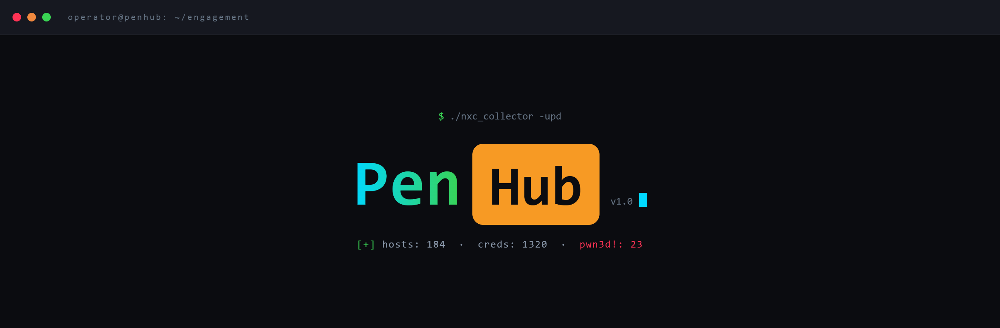
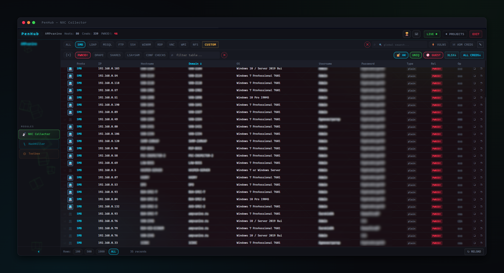

<div align="center">

**Self-hosted pentest credential aggregation platform**<br>
Built on top of [NetExec](https://github.com/Pennyw0rth/NetExec) · multi-operator · no external dependencies

[](https://python.org)
[](https://fastapi.tiangolo.com)
[](https://sqlite.org)
[](LICENSE)
[](https://github.com)

[🇬🇧 English docs](wiki/en/Wiki%20-%20table%20of%20contents.md) · [🇷🇺 Документация](wiki/rus/Wiki%20-%20%D0%BE%D0%B3%D0%BB%D0%B0%D0%B2%D0%BB%D0%B5%D0%BD%D0%B8%D0%B5.md) · [⚡ Quick Start](#-quick-start)

<br>



</div>

---

## What is PenHub?

During a pentest each operator accumulates hundreds of LSA/SAM/DPAPI/NTDS credential pairs — scattered across consoles, lost in scrollback. **PenHub turns that chaos into a single shared platform**: operators push their nxc findings every 10 minutes and instantly see the merged picture from all teammates.

Everything runs on your machine. No cloud, no Redis, no Postgres — just two SQLite files.

---

## Features

|  |  |
|--|--|
| 🗄 **Unified credential store** | All nxc protocols (SMB, LDAP, MSSQL, SSH, WinRM, RDP, VNC, FTP, NFS, WMI) in one view with deduplication, plaintext-over-hash priority and DPAPI |
| 🗡 **120M-hash lookup in seconds** | Global NTLM hash↔plaintext database shared across all projects — a hash cracked once is cracked everywhere, forever |
| ☠ **Domain admin tracking** | Upload a DA watchlist; get a notification the moment credentials for any name appear |
| ⚡ **Vulnerability matrix** | Per-host VULNS view: Zerologon, MS17-010, SMBGhost, PrintNightmare, noPac, PetitPotam, WDigest, NTLMv1 and more |
| 🎯 **One-click spray archive** | Paired `logins/passwords/hashes` files + not-yet-captured targets, ready for `nxc --no-bruteforce` |
| 📊 **Final report export** | ALL CREDS and VULNS as XLSX — attach directly to the pentest report |
| 👥 **Multi-operator real-time** | Independent crons, idempotent WAL merges — multiple operators push simultaneously, safely |
| 🔒 **Honeypot / hide logic** | Strike a host to suppress false positives; hidden items survive syncs but stay out of spray lists |
| 📴 **Offline extractor** | `nxce` generates spray files and nxc commands from the local merged DB — no server needed |
| ⚙ **Custom import** | Add credentials from web apps, bruteforce, or any non-nxc source via XLSX template |

---

## ⚡ Quick Start

### 1 — Server

```bash
git clone https://github.com/YOURNAME/penhub.git && cd penhub
pip install fastapi uvicorn openpyxl
python3 server.py --host 0.0.0.0 --port 322 --password "StrongPasswordHere!"
```

Open `http://<server-ip>:322/` → log in → create a project.

### 2 — Operator client

In PenHub, open the project → **Toolbox → Operator Environment Config → ↓ DOWNLOAD SCRIPTS**, then on the operator's machine:

```bash
unzip penhub-scripts.zip -d penhub && cd penhub
chmod +x nxc_collector && ./nxc_collector --install   # installs scripts + NXC modules + cron

# paste COPY CONFIG STRING from Toolbox:
nxc_collector -ws --server http://<server-ip> --port 322 --pass "StrongPasswordHere!" --workspace projectName --operator alice

nxc_collector --connection-test   # expect 200 OK
```

`--install` also copies `collector_dc.py` and `collector_hosts.py` to `~/.nxc/modules/`:

```bash
nxc smb 10.10.10.0/24 -u alice -p Password1 -M collector_hosts   # MS17-010, coerce, WDigest…
nxc smb dc01.corp.local -u alice -p Password1 -M collector_dc     # noPac, Zerologon
```

Results appear in **⚡ VULNS** after the next sync.

---

## Documentation

| | 🇬🇧 English | 🇷🇺 Русский |
|---|---|---|
| **Home / Contents** | [Wiki — table of contents](wiki/en/Wiki%20-%20table%20of%20contents.md) | [Wiki — оглавление](wiki/rus/Wiki%20-%20%D0%BE%D0%B3%D0%BB%D0%B0%D0%B2%D0%BB%D0%B5%D0%BD%D0%B8%D0%B5.md) |
| **Install server** | [Installation — Server](wiki/en/install/Installation-Server.md) | [Установка — Сервер](wiki/rus/install/%D0%A3%D1%81%D1%82%D0%B0%D0%BD%D0%BE%D0%B2%D0%BA%D0%B0%20%E2%80%94%20%D0%A1%D0%B5%D1%80%D0%B2%D0%B5%D1%80.md) |
| **Install operator client** | [Installation — Operator Client](wiki/en/install/Installation-Operator-Client.md) | [Установка — Клиент оператора](wiki/rus/install/%D0%A3%D1%81%D1%82%D0%B0%D0%BD%D0%BE%D0%B2%D0%BA%D0%B0%20%E2%80%94%20%D0%9A%D0%BB%D0%B8%D0%B5%D0%BD%D1%82%20%D0%BE%D0%BF%D0%B5%D1%80%D0%B0%D1%82%D0%BE%D1%80%D0%B0.md) |
| **Quick start** | [Quick Start](wiki/en/usage/Quick-Start.md) | [Быстрый старт](wiki/rus/usage/%D0%91%D1%8B%D1%81%D1%82%D1%80%D1%8B%D0%B9%20%D1%81%D1%82%D0%B0%D1%80%D1%82.md) |
| **Operator workflow** | [Operator Workflow](wiki/en/usage/Operator-Workflow.md) | [Пример работы](wiki/rus/usage/%D0%9F%D1%80%D0%B8%D0%BC%D0%B5%D1%80%20%D1%80%D0%B0%D0%B1%D0%BE%D1%82%D1%8B.md) |
| **Exports** | [Exports](wiki/en/usage/Exports.md) | [Экспорты](wiki/rus/usage/%D0%AD%D0%BA%D1%81%D0%BF%D0%BE%D1%80%D1%82%D1%8B.md) |
| **HashKiller module** | [Module — HashKiller](wiki/en/modules/Module-HashKiller.md) | [Модуль — HashKiller](wiki/rus/modules/%D0%9C%D0%BE%D0%B4%D1%83%D0%BB%D1%8C%20%E2%80%94%20HashKiller.md) |
| **Vulnerability details** | [Vulnerability Details](wiki/en/vulns/Vulnerability-Details.md) | [Описание уязвимостей](wiki/rus/vulns/%D0%9E%D0%BF%D0%B8%D1%81%D0%B0%D0%BD%D0%B8%D0%B5%20%D1%83%D1%8F%D0%B7%D0%B2%D0%B8%D0%BC%D0%BE%D1%81%D1%82%D0%B5%D0%B9%20%D0%B8%20%D0%B8%D1%85%20%D1%83%D1%81%D1%82%D1%80%D0%B0%D0%BD%D0%B5%D0%BD%D0%B8%D0%B5.md) |
| **Troubleshooting** | [Troubleshooting & FAQ](wiki/en/meta/Troubleshooting-and-FAQ.md) | [Решение проблем и FAQ](wiki/rus/meta/%D0%A0%D0%B5%D1%88%D0%B5%D0%BD%D0%B8%D0%B5%20%D0%BF%D1%80%D0%BE%D0%B1%D0%BB%D0%B5%D0%BC%20%D0%B8%20FAQ.md) |

---

## Stack

```
Server:   Python 3.12 / FastAPI / SQLite WAL / vanilla-JS SPA (no bundler, no framework)
Operator: bash + Python stdlib (no pip on client side)
State:    collector.db  (projects, hosts, credentials)
          hashkiller.db (global NTLM hash database)
```

---

> ⚠️ **Authorized use only.** PenHub is a tool for legitimate, authorized pentests and red-team assessments. It aggregates data that NetExec has already obtained — it does not exploit anything itself. All data stays on your infrastructure.

---

## ☕ Support

PenHub is free and always will be — I built it for my own team, then realized it could help others too. If it helped you and you feel like sending a few coins my way, that'd be great. And if not — a star on the repo makes me happy too. I'm slowly building a sim racing setup and saving up for a decent monitor and a wheel. Anything helps me get there a bit sooner. 🏎️

**Crypto:**

- **BTC:** `bc1q4sxpec5tg5kxdv57yp84qjpv56dndjd7ncgxam`
- **ETH:** `0x7c6f323bF0a550b60071d9214998366c36509500`
- **TON:** `UQC2aEPcAfwkotE7_yS_HL8cBKYO_HNFim6CgvvMX5KWaHOs`