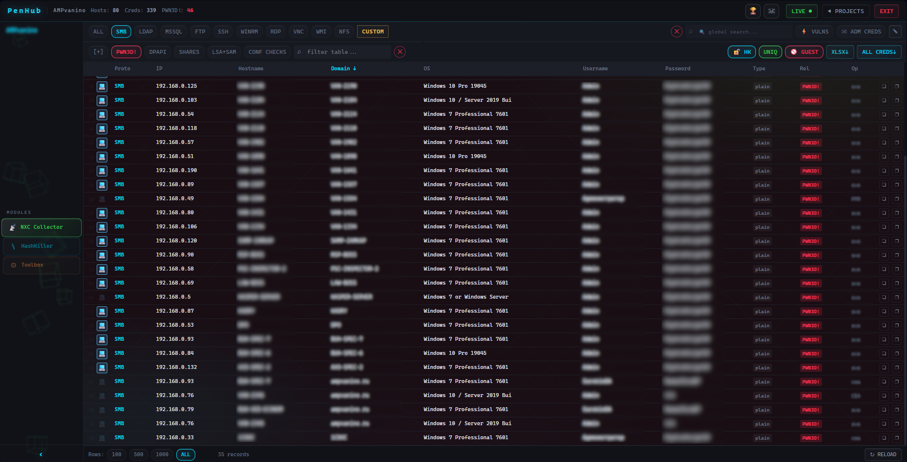

### PenHub Wiki

PenHub — a data aggregation platform for pentest results collected with [NetExec](https://github.com/Pennyw0rth/NetExec).

**Getting Started**
- [Quick Start](usage/Quick-Start.md)
- [Concepts and Glossary](reference/Concepts-and-Glossary.md)
- [Operator Workflow](usage/Operator-Workflow.md)

**Installation**
- [Installation — Server](install/Installation-Server.md)
- [Installation — Operator Client](install/Installation-Operator-Client.md)

**Modules and Features**
- [Module — NXC Collector](modules/Module-NXC-Collector.md)
- [Module — HashKiller](modules/Module-HashKiller.md)
- [Module — Toolbox](modules/Module-Toolbox.md)
- [Notifications](usage/Notifications.md)
- [Exports](usage/Exports.md)

**Internals**
- [Architecture](reference/Architecture.md)

**Reference**
- [Operator Scripts Reference](reference/Operator-Scripts-Reference.md)
- [Adapting to NetExec Schema Changes](reference/Adapting-to-NetExec-Schema-Changes.md)
- [Vulnerability Reference](vulns/Vulnerability-Reference.md)
- [Vulnerability Details and Remediation](vulns/Vulnerability-Details.md)
- [Troubleshooting and FAQ](meta/Troubleshooting-and-FAQ.md)

# PenHub

**PenHub** is a self-hosted web platform for **pentest / red team operators**. It aggregates data that [NetExec (nxc)](https://github.com/Pennyw0rth/NetExec) writes to its databases.

It runs as a self-hosted server deployed on your internal/working network. Operators run a small client script on their machines that sends data from nxc databases to your local server via API, and pulls back the unified data collected from all other operators.

---

## What problem does it solve?

During a pentest, each operator accumulates (and then loses) enormous amounts of data in the console: hundreds of LSA/SAM/DPAPI credential pairs and more. PenHub turns this chaos into a unified, convenient platform for all operators:

- **One workspace per project** — data from all operators flows into a single project.
- **Advanced credential display and filtering logic** — automatic deduplication, plaintext priority over hash, domain admin watchlist, honeypot hiding.
- **HashKiller** — a global (across all your projects) NTLM hash↔plaintext database that grows every time any operator finds a plaintext password.
- **Spray list preparation** — generate login/password/hash and target files in one click.
- **Vulnerability summary** — a vulnerability matrix by host (Zerologon, PetitPotam, MS17-010, …) for the final report.
- **Final credentials table** — a convenient view of all discovered data in a single Excel spreadsheet.

---

## About its purpose

PenHub is a **tool for legitimate, authorized engagements**. It collects and organizes data that NetExec has already obtained during a pentest or red-team assessment. PenHub exploits nothing.
PenHub sends nothing to and aggregates nothing on third-party servers. It is a fully local, self-hosted tool.
