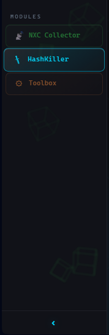

# Architecture

### Not needed in day-to-day work. A reference for debugging and understanding internal mechanics.

```
        OPERATOR MACHINES (NetExec)                    PENHUB SERVER
 ┌─────────────────────────────────────┐      ┌──────────────────────────────┐
 │ nxc writes  ~/.nxc/workspaces/<ws>/  │      │  FastAPI application (penhub/app.py)
 │   smb.db ldap.db winrm.db … rdp.db  │      │                              │
 │   nxc-vulns.db                       │      │   Shell  ──┬── NXC Collector │
 │                                      │push  │            ├── HashKiller    │
 │ nxc_updater.py (cron */10) ──────────┼─────►│  /api/sync ├── Toolbox       │
 │            ◄─────────────────────────┼─pull │  /api/...  │                 │
 │ nxc-collector.db (local merged DB)   │      │   collector.db  hashkiller.db│
 │ nxce.py  (offline extractor)         │      │   (per project)  (global)    │
 └─────────────────────────────────────┘      └──────────────────────────────┘
```

- **Server**: Python / FastAPI / SQLite (WAL) + vanilla JS SPA. No bundler, no framework, no build step. Two SQLite files.
- **Operator client**: three scripts. Described in **[Installation — Operator Client](../install/Installation-Operator-Client.md)** and **[Operator Scripts Reference](Operator-Scripts-Reference.md)**.

---

## Server: Shell + Modules

The server application is a **shell** into which **modules** are plugged.

```
PenHub Shell
├── NXC Collector   (eager — built into shell, loaded immediately)
├── HashKiller      (lazy — loaded on first open)
└── Toolbox         (lazy — loaded on first open)
```

- The **shell** handles navigation, authorization, the common layout, module registry, and delivery of each module's UI fragment.
- Each **module** is responsible only for its own functionality, and modules communicate with each other only through the shared database and HTTP API — never directly.
- Adding a module = "implement `BaseModule` + register". Existing modules are not changed. The registration checklist is at the top of `penhub/app.py`.

| Module        | Package                  | Loading | Icon       |
|---|---|---|---|
| NXC Collector | `modules/nxc_collector/` | Eager   | 📡 green   |
| HashKiller    | `modules/hashkiller/`    | Lazy    | 🗡 blue    |
| Toolbox       | `modules/toolbox/`       | Lazy    | ⚙ orange   |

Lazy module UI is delivered via `GET /api/shell/module/{id}/ui` (under authorization).



---

## Databases

| File                                      | Purpose                                                                         | Rule                                          |
| ----------------------------------------- | ------------------------------------------------------------------------------- | --------------------------------------------- |
| `collector.db`                            | Server working DB: projects, hosts, credentials, auth relations, DPAPI, shares, vulnerabilities | Schema changes via migrations only   |
| `hashkiller.db`                           | Global NTLM hash database (`hk_pairs`)                                           | Schema changes via migrations only            |
| `~/.nxc/workspaces/<ws>/nxc-collector.db` | Operator's local merged DB                                                      | Schema defined by `nxc_updater._init_local_db` |

- **SQLite in WAL mode** everywhere — do not change the engine. Expect accompanying `*.db-wal` / `*.db-shm` files.
- Migrations are **backward-compatible** — `ALTER TABLE` / `CREATE TABLE IF NOT EXISTS` in `collector/db.py`.
- `collector/db.py` and `collector/hashkiller_db.py` are stable internal APIs used throughout.

---

## Sync pipeline (server side)

When an operator pushes, `POST /api/sync` runs an ordered pipeline (outline):

```
SyncPayload (JSON)
  → password normalization
  → UPSERT hosts / INSERT-OR-IGNORE credentials / UPSERT auth_relations
  → DPAPI / shares / ssh_keys / conf_checks / directory_listings / vuln_findings
  → emit "new PWN3D host" notifications
  → auto-hide honeypot (new credentials on honeypot hosts)
  → domain admin enrichment (flag watchlist accounts) + "new domain admin" notifications
  → background: substitute cracked plaintext from global hash database
```

The merge is **idempotent** (`INSERT OR IGNORE` / `UPSERT`), and WAL serializes parallel pushes, so simultaneous syncs from multiple operators to the same project are safe.

---

## Frontend

The SPA is plain files served from `static/`, loaded in a fixed order defined in `collector/frontend.py`:

- **CSS**: design system tokens → DS core → `shell-*.css` (base, controls, table, sidebar, misc, login, projects) → module CSS.
- **JS**: React UMD (used only for the login animation) → DS bundle → `auth-app.js` → `shell-core.js` → `shell-projects.js` → the `shell-nxc-*.js` family → module JS.

All NXC Collector functions are **global** (referenced by inline `onclick` handlers in server-rendered HTML). This is intentional, which is why load order is fixed.

---

## Code map

| Area                                               | Code                                                              |
| -------------------------------------------------- | ----------------------------------------------------------------- |
| App factory and module registration                | `penhub/app.py`                                                   |
| Module registry                                    | `penhub/shell/registry.py`                                        |
| Authorization                                      | `collector/core/auth.py`                                          |
| DB schema and migrations                           | `collector/db.py`                                                 |
| Global hash database                               | `collector/hashkiller_db.py`                                      |
| Sync endpoint                                      | `collector/api/sync.py`                                           |
| Password normalization                             | `collector/services/sync_service.py`                              |
| Deduplication algorithms                           | `collector/services/data_service.py`                              |
| API                                                | `collector/api/*.py` (registered in `collector/api/router.py`)    |
| Sync engine                                        | `nxc_updater.py` (standalone)                                     |
| Operator extractor                                 | `nxce.py` (standalone)                                            |
| DB schema map                                      | `nxc_schema.json`                                                 |
