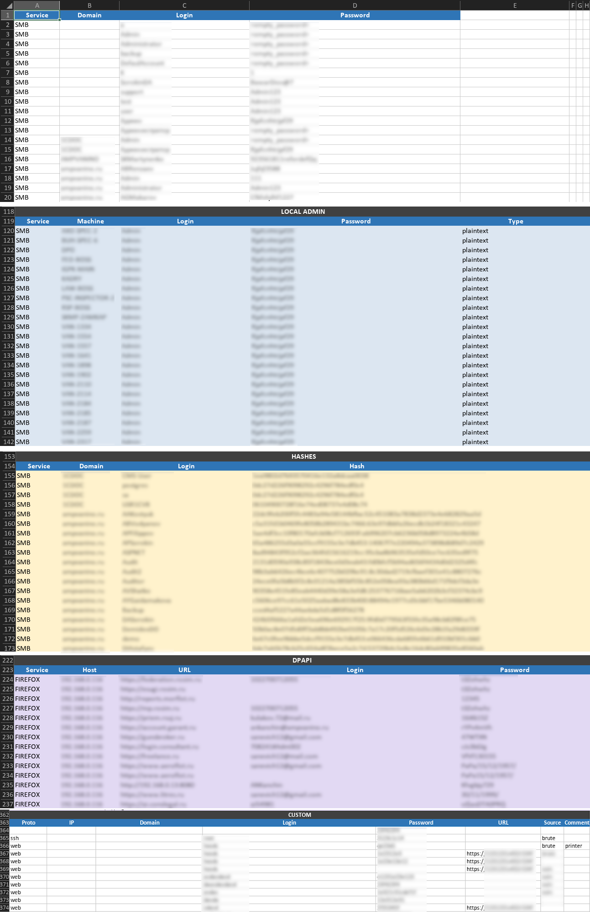

# Exports

PenHub has three types of exports: **XLSX** tables (for review/reporting), **TXT** lists (mainly for attack progression), and **ZIP** archives (paired files for credential sprays).

---

## From NXC Collector

| Export     | Contents                                                                           |
| ---------- | ---------------------------------------------------------------------------------- |
| **XLSX ↓** | The *current* table view (respecting active GUEST, UNIQ, HK-bruted filters). XLSX. |

The **UNIQ** option deduplicates by `domain+login+password`, preferring plaintext over hash and admin over loggedin. The **HK-bruted** filter, when enabled, substitutes known plaintext for hashes before export — so the table contains cracked passwords instead of hashes.

---

## From Reports

| Export                  | Contents                                                                                                              |
| ----------------------- | -------------------------------------------------------------------------------------------------------------------- |
| **ALL CREDS ↓**         | All *unique* credentials in the project, split into logical blocks. XLSX. *(previously in NXC Collector)*            |
| **ALL VULNS ↓**         | Per-host vulnerability matrix (the VULNS — ALL view). XLSX.                                                          |
| **LOCAL ADMINS ↓**      | Local admins: a section of real local admins + a section of local accounts whose credentials repeat across machines. XLSX. |
| **DOWNLOAD TIMELINE ↓** | Engagement timeline (First sync → First Domain Admin + your own points) with intervals between points. TXT.          |

See **[Module — Reports](../modules/Module-Reports.md)**.



---

## From Toolbox (Block 2) — ready-made lists

| Export               | Contents                                                        |
| -------------------- | --------------------------------------------------------------- |
| **ALL UNIQ LOGINS**  | Unique logins, lowercase, no Guest. TXT.                        |
| **ALL UNIQ PASS**    | Unique plaintext passwords (after HK-brute). TXT.               |
| **ALL UNIQ HASHES**  | Unique uncracked NT hashes. TXT.                                |
| **ALL UNIQ IP**      | Unique host IPs. TXT.                                           |
| **NOT PWN3D IPs**    | Hosts with no successful admin authentication. TXT.             |
| **DOWNLOAD ARCHIVE** | ZIP of 5 paired files for nxc password spray (see below).       |

### Password spray archive

`DOWNLOAD ARCHIVE`:

```
not_pwnd_ip.txt        ← targets (hosts not yet captured)
plaintext_logins.txt   ┐ paired 1:1
plaintext_passes.txt   ┘
hashes_logins.txt      ┐ paired 1:1
hashes_passes.txt      ┘
```

Line N in `*_logins.txt` corresponds to line N in `*_passes.txt`.

---

## From HashKiller

| Export             | Contents                                                                                                                   |
| ------------------ | -------------------------------------------------------------------------------------------------------------------------- |
| **DOWNLOAD DB**    | Full global hash database (backup / transfer).                                                                              |
| **HASHES.TXT**     | Uncracked NT hashes for the current project, for `hashcat -m 1000`. Duplicates the **ALL UNIQ HASHES** button in Toolbox. |
| **EXPORT SMART**   | All `hash:plain` pairs added by SMART ENRICH (`SMART=true`).                                                               |
| **EXPORT WARNING** | All conflicting `hash:plain` pairs (`warning=true`).                                                                        |

---

## Generating lists on the operator's machine

All Toolbox exports can be generated on the operator's machine without a server connection, from the local merged database (when available):

```bash
nxce all --nxc            # ready-to-run nxc commands for each PWN3D host
nxce smb --ip             # unique IPs of SMB PWN3D hosts
nxce --brute ./spray      # write paired login/password/hash files for spray
```

`nxce` supports flexible filtering (by login, password, IP, etc.) — explore `--help`.

`nxce --brute` mirrors the `DOWNLOAD ARCHIVE` functionality in Toolbox: writes `logins_P_brut.txt` / `pass_for_brute.txt` (plaintext) and `logins_H_brut.txt` / `hashes_for_brute.txt` (NT hashes), each pair the same length, and prints the ready-to-use `nxc … --no-bruteforce --continue-on-success` command. See **[Operator Scripts Reference](../reference/Operator-Scripts-Reference.md)**.
