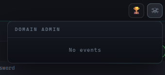

# Notifications

PenHub notifies you **near real-time** about two events: a new host captured, or a domain admin account from the watchlist appeared.

---

## Two types of notifications

| Bell                 | Fires when                                                                                          |
| -------------------- | --------------------------------------------------------------------------------------------------- |
| 🏆 **PWN3D**         | A host receives its **first** admin relation (PWN3D) — i.e. the machine was just captured. One event per host. |
| ☠ **Domain Admin**   | An account from the **Domain Admin Watchlist** is found (password/hash appeared). One event per account. |

Clicking a notification navigates to the object using the global search (hostname for PWN3D, username for domain admin).

---

## How "unread" is counted

- The server maintains an **append-only event log** (`GET /api/notifications`). It never edits or deletes — only appends.
- "Unread" is counted **in your browser** from `localStorage`. Opening a notification marks it as read in that browser.
- Since the entire platform uses a single access key, "per-browser" effectively means "per person" — each operator's browser tracks its own read state, with no server-side identity.
- Notifications poll the server every **15 seconds, independently of the LIVE toggle**, and count only events for the **current** (open) project.
