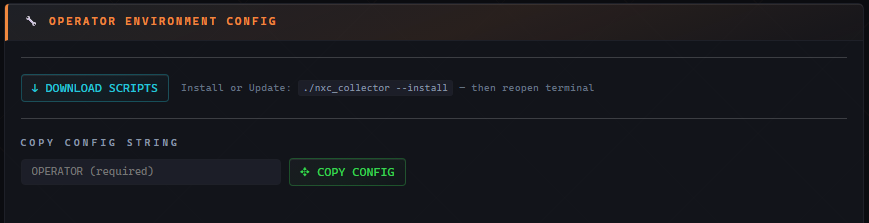

# Установка — Клиент оператора

Каждый оператор, запускающий NetExec, ставит на свою рабочую машину три небольших скрипта и два кастомных NXC-модуля. Скрипты отправляют данные nxc на ваш сервер и забирают объединённую (с другими операторами) БД обратно. Всё — **только stdlib Python + bash**, никаких pip-пакетов на стороне оператора.

Три скрипта:

| Скрипт                 | Роль                                                                                                                                                   |
| ---------------------- | ------------------------------------------------------------------------------------------------------------------------------------------------------ |
| `nxc_collector` (bash) | Установщик и конфигуратор. Раскладывает остальные скрипты по местам, пишет конфиг, ставит cron. Сам по себе не манипулирует данными!                   |
| `nxc_updater.py`       | Движок синхронизации. Запускается из cron каждые 10 минут: читает базы nxc, пушит на сервер, тянет объединённый воркспейс обратно.                     |
| `nxce.py`              | Офлайн-экстрактор («PWN3D Extractor»). Читает локальную объединённую БД, формируя списки целей и файлы для спрея. С сервером не общается. (см. --help) |

Два кастомных NXC-модуля (ставятся в `~/.nxc/modules/` автоматически при `--install`):

| Модуль               | Что проверяет                                                                                                                                                                                                                                       |
| -------------------- | --------------------------------------------------------------------------------------------------------------------------------------------------------------------------------------------------------------------------------------------------- |
| `collector_dc.py`    | Проверки специфичные для DC: **noPac** (CVE-2021-42278/42287) и **Zerologon** (CVE-2020-1472). Запускать с `nxc ... -M collector_dc` на целях-DC.                                                                                                   |
| `collector_hosts.py` | Общие проверки хостов: **MS17-010/EternalBlue**, **SMBGhost**, **Coerce** (DFSCoerce/ShadowCoerce/PrinterBug/PetitPotam), **WebDAV**, **PrintNightmare**, **WDigest**, **NTLMv1**, **RunAsPPL**, **UAC**. Запускать с `nxc ... -M collector_hosts`. |

Модули представляют из себя копию уже имеющихся модулей в nxc. Проблема стандартных модулей – они НЕ пишут данные в nxcdb. Для того чтобы собирать их в NXC Collector мы переписали эти проверки и добавили запись в `nxc-vulns.db`.

Результаты обоих модулей сохраняются в `nxc-vulns.db` в отдельном воркспейсе и уходят на сервер при следующем запуске `nxc_updater` — появляются в представлении **VULNS** в NXC Collector.

> Все флаги всех трёх скриптов — в **[Справочник по скриптам оператора](../reference/%D0%A1%D0%BF%D1%80%D0%B0%D0%B2%D0%BE%D1%87%D0%BD%D0%B8%D0%BA%20%D0%BF%D0%BE%20%D1%81%D0%BA%D1%80%D0%B8%D0%BF%D1%82%D0%B0%D0%BC%20%D0%BE%D0%BF%D0%B5%D1%80%D0%B0%D1%82%D0%BE%D1%80%D0%B0.md)**.

---

## Требования

- Linux-машина с уже установленным и работающим **[NetExec](https://github.com/Pennyw0rth/NetExec)**.
- Python 3 (stdlib) и `cron`.
- Сетевая доступность сервера PenHub по host:port.

---

## Самый простой путь: взять скрипты с сервера

Сервер отдаёт готовый комплект и строку конфига. Просто скопировать и вставить.

1. В браузере войдите в PenHub, откройте проект, перейдите в модуль **Toolbox** → **Блок Operator Environment Config**.
2. Нажмите **↓ DOWNLOAD SCRIPTS** — скачается ZIP с `nxc_collector`, `nxc_updater.py`, `nxce.py`, `collector_dc.py`, `collector_hosts.py`.
3. Распакуйте на машине оператора и установите:

```bash
unzip penhub-scripts.zip -d penhub-scripts
cd penhub-scripts
chmod +x nxc_collector
./nxc_collector --install
```

`--install` копирует три скрипта в `/usr/local/bin` (или `~/bin`, если туда нет прав), делает их исполняемыми, ставит cron (`*/10` + `@reboot`), и **копирует `collector_dc.py` и `collector_hosts.py` в `~/.nxc/modules/`** — NetExec подхватит их автоматически. После — **перезапустите терминал**.



---

## Настройка подключения

В том же блоке заполните поле **OPERATOR** (ваш никнейм — он метит каждую строку, которую вы вносите) и нажмите **COPY CONFIG STRING**. Получите строку вида:

```bash
nxc_collector -ws --server http://10.10.10.5 --port 322 --pass "StrongPasswordHere!" --workspace organisanionX --operator alice
```

Выполните её на машине оператора. Это создаст `~/.nxc-collector.conf` и  при необходимости создаёт локально новый воркспейс.

Проверка связи:

```bash
nxc_collector --connection-test
# 200 = OK · 401/403 = неверный пароль · пусто = сервер недоступен

nxc_collector --show-options
# печатает активный конфиг (пароль замаскирован), воркспейс, секцию BloodHound
```

> ⚠️ Проект (`--workspace`) **должен уже существовать на сервере**, иначе при синхронизации ничего не произойдет. Если его нет, `nxc_updater` молча пропускает (exit 0) и ничего не пушит — это сделано намеренно, чтобы опечатка не плодила мусорные проекты. Сначала создайте проект на странице Projects в PenHub.

---

## Использование кастомных NXC-модулей

После установки модули лежат в `~/.nxc/modules/`. Добавляйте `-M collector_hosts` или `-M collector_dc` к командам nxc:

```bash
# Проверить все хосты на MS17-010, coerce, PrintNightmare, WDigest и т.д.
nxc smb 10.10.10.0/24 -u alex -p Password1 -M collector_hosts

# Проверить контроллеры домена на noPac и Zerologon
nxc smb dc01.corp.local -u alex -p Password1 -M collector_dc
```

Результаты попадают в `~/.nxc/workspaces/<ws>/nxc-vulns.db` и уходят на сервер при следующей синхронизации. Смотрите их в **⚡ VULNS** в NXC Collector.

---

## Что  дальше

После настройки cron запускает `nxc_updater.py` каждые 10 минут. Каждый запуск:

1. **Push** — читает все `~/.nxc/workspaces/<ws>/{proto}.db` плюс `nxc-vulns.db`, нормализует и выполняет `POST` в `/api/sync`.
2. **Pull** — `GET` объединяет воркспейс на сервере и перезаписывает локальную объединённую БД `~/.nxc/workspaces/<ws>/nxc-collector.db`.

Во время работы вручную ничего запускать не нужно — просто пользуйтесь nxc как обычно. Чтобы синхронизировать принудительно:

```bash
nxc_collector -upd
```

Чтобы экспортировать различные списки целей/паролей/логинов офлайн в любой момент (сервер не нужен):

```bash
nxce all --nxc          # готовые команды nxc для каждого PWN3D-хоста
nxce smb -u admin       # admin-учётки SMB по пользователю 'admin'
nxce --brute ./spray    # записать парные файлы логинов/паролей/хэшей для спрея

# и многое многое другое...
```

Подробнее в: **[Пример работы](../usage/%D0%9F%D1%80%D0%B8%D0%BC%D0%B5%D1%80%20%D1%80%D0%B0%D0%B1%D0%BE%D1%82%D1%8B.md)**, все флаги — в **[Справочник по скриптам оператора](../reference/%D0%A1%D0%BF%D1%80%D0%B0%D0%B2%D0%BE%D1%87%D0%BD%D0%B8%D0%BA%20%D0%BF%D0%BE%20%D1%81%D0%BA%D1%80%D0%B8%D0%BF%D1%82%D0%B0%D0%BC%20%D0%BE%D0%BF%D0%B5%D1%80%D0%B0%D1%82%D0%BE%D1%80%D0%B0.md)**.

---

## Опционально: конфиг BloodHound

Если вы в своей работе используете BloodHound, Toolbox также формирует строку `--bh-setup`, которую можно выполнить, чтобы сохранить настройки подключения BloodHound в `~/.nxc/nxc.conf`. Эти настройки сохраняются на сервере. Подробнее — в **[Модуль — Toolbox](../modules/%D0%9C%D0%BE%D0%B4%D1%83%D0%BB%D1%8C%20%E2%80%94%20Toolbox.md)**.

---

## Удаление

```bash
nxc_collector --install -rm
```

Удаляет бинарники и cron-записи. Ваш конфиг, лог и локальная БД **сохраняются**.

