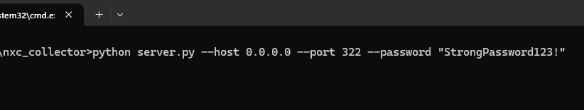
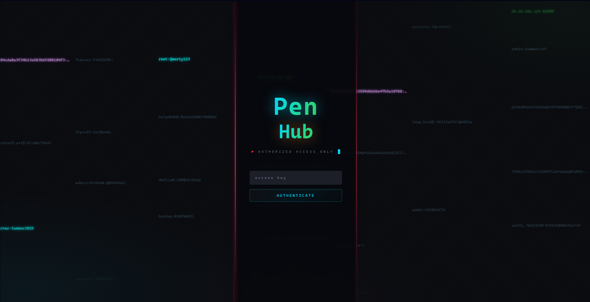

# Установка — Сервер

Сервер PenHub — простой Python-процесс. Вы разворачиваете его на машине, доступной операторам по внутренней/рабочей сети, вся работа происходит в браузере. Отдельную СУБД ставить не нужно — используются файлы SQLite, создаваемые при первом запуске.

---

## Требования

- **Python 3.12+**.
- Три Python-пакета: `fastapi`, `uvicorn`, `openpyxl`.
- Машина, доступная для оператора.
- Открытый TCP-порт (по умолчанию **322**).

> У PenHub нет внешних сервисов, нет Redis, нет Postgres. Состояние живёт в двух файлах SQLite рядом с кодом (`collector.db`, `hashkiller.db`), создаваемых автоматически при первом старте.

---

## Установка

```bash
# 1. скачать проект
git clone https://github.com/YOURNAME/penhub.git
cd penhub

# 2. (рекомендуется) виртуальное окружение
python3 -m venv .venv
source .venv/bin/activate

# 3. зависимости
pip install fastapi uvicorn openpyxl

# 4. запуск
python3 server.py --host 0.0.0.0 --port 322 --password "ВыберитеНадёжныйПароль"
```

Это всё. При первом старте сервер создаёт `collector.db`, `hashkiller.db` и каталог `hk_inbox/`, после слушает обращения.



---

## Параметры командной строки

| Флаг         | Пример               | Значение                                                 |
| ------------ | -------------------- | -------------------------------------------------------- |
| `--host`     | `0.0.0.0`            | Интерфейс для прослушивания.                             |
| `--port`     | `322`                | TCP-порт.                                                |
| `--password` | `StrongPassword123!` | **Единый ключ доступа** для всей платформы. Смените его. |

Пароль — единственный учётный секрет. Он хэшируется через `sha256` и используется и для входа в браузере, и как `X-Auth-Token` клиентов-операторов. Учётных записей 
пользователей нет — любой, у кого есть ключ доступа, получает доступ к проектам.
Такая конфигурация сделана намеренно, для простоты доступа во время пентеста (PenHub задуман для использования внутри локальной сети).

---

## Первый вход

Откройте `http://<ip-сервера>:<порт>/` в браузере и введите ключ доступа.



После входа вы попадёте на страницу **Projects**. Создайте первый проект — см. **[Быстрый старт](../usage/Быстрый%20старт.md)**.

---

## Запуск службы

Вариант запуска PenHub как службы. Пример `systemd`:

```ini
# /etc/systemd/system/penhub.service
[Unit]
Description=PenHub server
After=network.target

[Service]
WorkingDirectory=/opt/penhub
ExecStart=/opt/penhub/.venv/bin/python server.py --host 0.0.0.0 --port 322 --password "StrongPasswordHere!"
Restart=on-failure
User=penhub

[Install]
WantedBy=multi-user.target
```

```bash
sudo systemctl enable --now penhub
```

> Ключ доступа лежит в юнит-файле в открытом виде — поставьте ему `chmod 600` и ограничьте  права пользователей на чтение `/etc/systemd/system/`.

---

## Бэкапы

PenHub сам по себе не делает бэкапы. Только ручной режим. В интерфейсе есть соответствующие кнопки для скачивания БД.

- **`collector.db`** хранит хосты и учётные данные всех проектов. **`hashkiller.db`** хранит глобальную базу хэшей. Бэкапить оба файла будет не лишним.
- SQLite работает в **режиме WAL** — вы увидите также сопутствующие файлы `*.db-wal` / `*.db-shm`. Бэкапьте весь набор, в идеале останавливайте сервер перед копированием.


Далее: **[Установка — Клиент оператора](Установка%20—%20Клиент%20оператора.md)** — настроить машину оператора.
