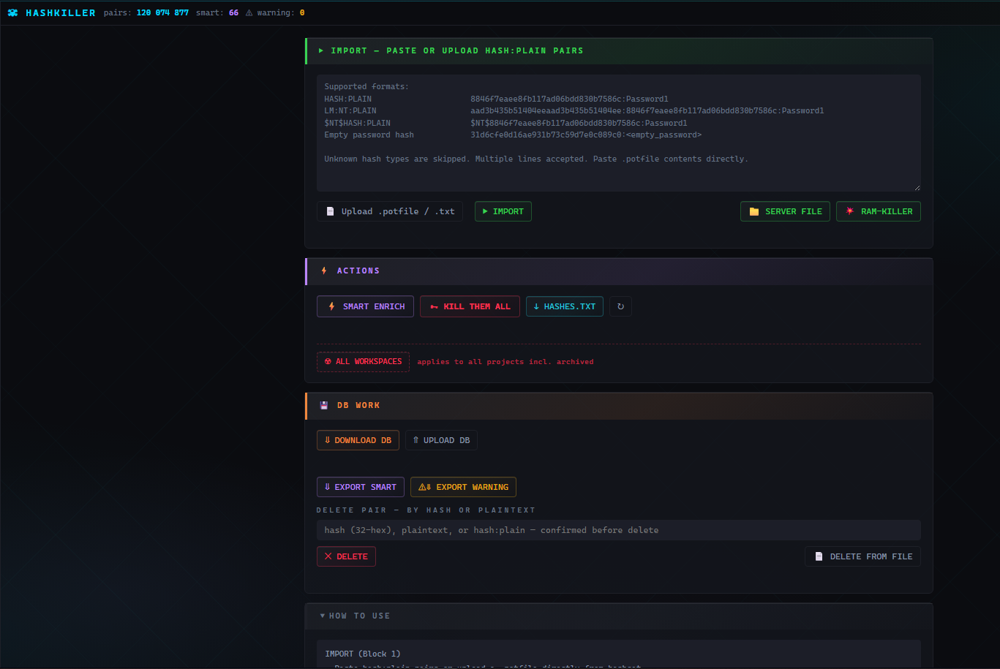

# Модуль — HashKiller 🗡

**База NTLM-хэшей**, общая для каждого проекта. Работает только с **NT-хэшами**. 
Каждый раз, когда кто-либо, в любом из проектов, находит пароль в открытом виде, его NT-хэш становится навсегда «взломанным» для всей платформы.

Хэш пустого пароля `31D6CFE0D16AE931B73C59D7E0C089C0` хранится как литерал `<empty_password>`.

**Поля в БД:** `hash`, `plaintext`, `SMART` (bool), `warning` (bool). Верхняя полоса показывает три счётчика: **pairs** / **smart** / **⚠ warning**.

Страница состоит из четырёх блоков.

---

## Блок 1 — IMPORT

Вставьте текстом или загрузите `.potfile` / `.txt`. Распознаваемые форматы:

- `HASH:PLAIN`
- `LM:NT:PLAIN`
- `$NT$HASH:PLAIN`

Неизвестные строки пропускаются.

| Кнопка             | Что делает                                                                                                                                                                                                                             |
| ------------------ | -------------------------------------------------------------------------------------------------------------------------------------------------------------------------------------------------------------------------------------- |
| **▶ IMPORT**       | Импорт вставленного текста или выбранного файла (до 50 МБ).                                                                                                                                                                            |
| **📁 SERVER FILE** | Импорт большого потфайла, заранее загруженного на сервер в `hk_inbox/large.potfile`. Фоновая задача, кеш ограничен 256 МБ. Для многогигабайтных файлов.                                                                                |
| **💥 RAM-KILLER**  | То же, что SERVER FILE, но раздувает кеш под большую часть (60-70%) свободной RAM ради максимальной скорости на крупной базе. Не пугайтесь названия, оно образное. У вас останется порядка 40% свободной памяти для работы с сервером. |

Результат показывает `added / already existed / время (скорость) / cache MB`.

> SERVER FILE / RAM-KILLER —  рассчитан на приём гигабайтов взломанных хэшей. Такие списки можно получить, если самому трансформировать большой словарь в формат hash:plaintext.
> 
> После крупного импорта **обязательно** проверьте и удалите warnings.

---

## Блок 2 — ACTIONS

| Кнопка               | Что делает                                                                                                                                                                                                                                                                                                                               |
| -------------------- | ---------------------------------------------------------------------------------------------------------------------------------------------------------------------------------------------------------------------------------------------------------------------------------------------------------------------------------------- |
| **⚡ SMART ENRICH**   | В рамках текущего проекта: берёт каждый plaintext-пароль (`credentials` + custom-импорты, которые ещё не промаркированы как bruteforced), локально считает его NT-хэш и добавляет пару `nt:plaintext` с флагом `SMART=true`. Так пароль, увиденный однажды, становится взломом в каждом последующем проекте. Пустые пароли пропускаются. |
| **🕽 KILL THEM ALL** | Для каждого NT-хэша в текущем проекте без plaintext ищет соответствие в HashKiller; если найдено — пишет пароль в поле *Brutforced* учетной записи.                                                                                                                                                                                      |
| **↓ HASHES.TXT**     | Скачать все непробрученные NT-хэши текущего проекта (для `hashcat -m 1000`).                                                                                                                                                                                                                                                             |
| **☢ ALL WORKSPACES** | Применит логику KILL THEM ALL по *всем* проектам, включая архивные.                                                                                                                                                                                                                                                                      |

Длительные операции имеют прогресс-бар (`Processing: X / Y`) и кнопку **✕ Cancel**.

**Цикл работы с модулем:** нажмите **SMART ENRICH**, чтобы собрать уже имеющийся plaintext, затем **KILL THEM ALL**, чтобы подставить совпавшие хэши. Оставшиеся хэши выгрузите кнопкой **↓ HASHES.TXT** для перебора в hashcat, затем импортируйте результаты в Блок 1.

---

## Блок 3 — DB WORK

| Кнопка                  | Что делает                                                                                                                                            |
| ----------------------- | ----------------------------------------------------------------------------------------------------------------------------------------------------- |
| **↓ DOWNLOAD DB**       | Скачать базу HashKiller (бэкап / передача).                                                                                                           |
| **↑ UPLOAD DB**         | Загрузить базу и *обогатить* (не заменить) текущую. Тот же хэш с другим plaintext → обе пары сохраняются, `warning=true`.                             |
| **↓ EXPORT SMART**      | Выгрузить все пары `hash:plain` с `SMART=true`.                                                                                                       |
| **⚠↓ EXPORT WARNING**   | Выгрузить все пары `hash:plain` с `warning=true`.                                                                                                     |
| **✕ DELETE**            | Удалить по хэшу, plaintext или паре `hash:plain`. Сначала поиск, отображение совпадений с флагами SMART/warning, удаление только после подтверждения. |
| **📄 DELETE FROM FILE** | Массовое удаление: загрузить txt со строками `hash:plain` или `hash` (например, файл EXPORT WARNING) → удаляются все совпадения.                      |

Пара экспорт/удаление — это способ разрешать **warning**-конфликты: выгрузить warning'и, решить, какие plaintext неверны, и массово удалить их из файла.

---

## Блок 4 — HOW TO USE

Блок-справка с описанием форматов импорта, логики SMART Enrich, логики KILL THEM ALL и типичного воркфлоу.

---

## Производительность на практике

Построение базы и индекса действительно занимает много времени на больших словарях, но это необходимо выполнить разово; всё, что после, работает быстро.

- **Первичное построение — только один раз:** импорт словаря на **120 млн паролей** через **💥 RAM-KILLER** и построение индекса заняли **~6 часов на 32 ГБ RAM**.
- **Каждый запуск после этого:** **🕽 KILL THEM ALL** — поиск и «расшифровка» по тем же **120 млн пар** — идёт со скоростью примерно **500 хэшей в секунду на SSD**. В рамках проекта мы получаем несколько тысяч хешей с домена или из lsa/sam и за несколько секунд перебираем все эти пары по словарю на 120 000 000 слов. 

---

## Связь с другими модулями

- **NXC Collector** использует HashKiller: фильтр **HK-bruted 🔓** показывает взломанный plaintext вместо хэша везде, где есть совпадение.
- **Архивирование проекта** автоматически запускает фоновый SMART Enrich, чтобы plaintext проекта попал в глобальную базу.
- Поскольку база глобальная, хэш, взломанный при работе над *clientA*, мгновенно «взломан», когда вы получите учетные данные *clientB*. Это имеет накопительный эффект.

