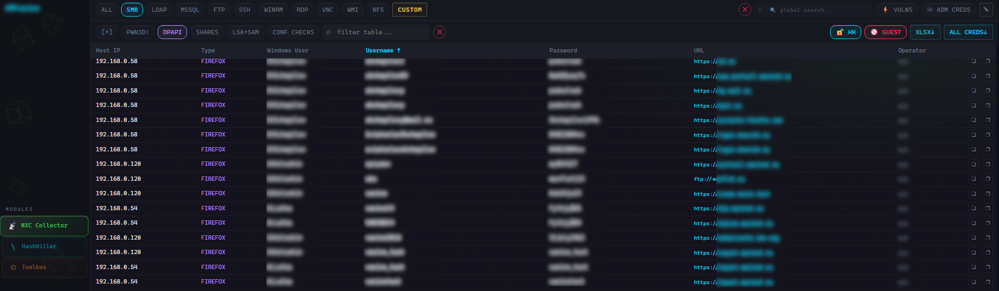
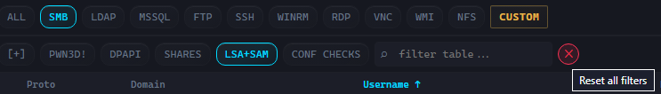
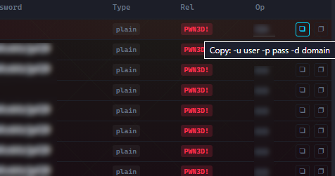
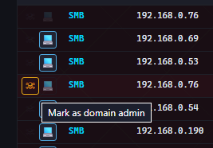
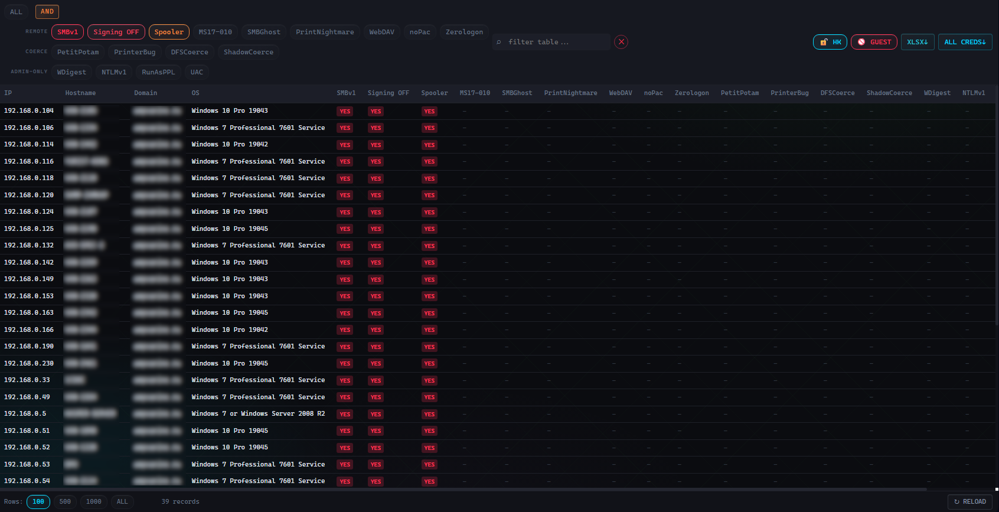
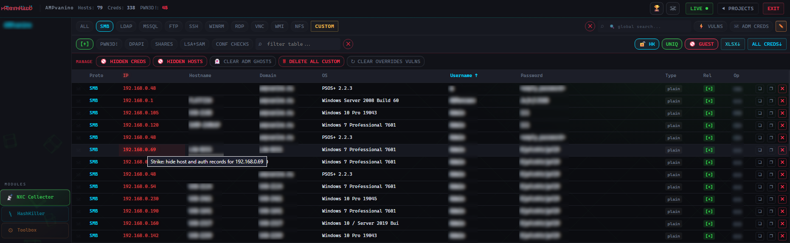
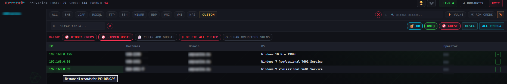

# Модуль — NXC Collector 📡

Главный модуль системы. Отображает, сортирует, фильтрует и управляет всем, что накоплено в рамках проекта.

---

## Навигация в модуле

### Ряд 1 — протоколы и глобальные действия 

Выберите протокол (или специальное представление). 

| Кнопка          | Показывает                                                                                 |
| --------------- | ------------------------------------------------------------------------------------------ |
| **ALL**         | Всё в проекте: учетные записи всех протоколов + DPAPI + custom                             |
| **SMB**         | Хосты (с флагами уязвимостей), учетные записи, шары, DPAPI, LSA/SAM, проверки конфигурации |
| **LDAP**        | Хосты, учетные записи                                                                      |
| **MSSQL**       | Хосты, учетные записи, sysadmin                                                            |
| **FTP**         | Хосты, учетные записи, листинги директорий                                                 |
| **SSH**         | Хосты, учетные записи, SSH-ключи                                                           |
| **WinRM**       | Хосты, учетные записи                                                                      |
| **RDP**         | Только хосты (флаг NLA; учетных записей нет)                                               |
| **VNC**         | Учетные записи + приватный ключ                                                            |
| **WMI**         | Учетные записи                                                                             |
| **NFS**         | Учетные записи, NFS-шары                                                                   |
| **☠ ADM CREDS** | Специальное представление: domain admin (CREDS) + local admin (LOCAL ADMIN)                |
| **⚡ VULNS**     | Специальное представление: матрица уязвимостей по хостам                                   |

Также в ряду 1:
- **✏ MANAGE** — переключает модуль в состояние Manage Mode (ниже).
- **Глобальный поиск** — contains-поиск сразу по *всей* БД проекта (все поля всех таблиц, кроме числовых ID и булевых флагов). При активации сбрасывает выбранный протокол и фильтры. Колонки результата: *(тип)* · Protocol · IP · Login · Password · Matched in · Details. Рядом кнопка сброса протокола, фильтров и поиска (переключатели GUEST / UNIQ / HK-bruted  *не* сбрасываются).
- **CUSTOM** —  отображение учетных записей, добавленных с помощью модуля Toolbox, см. [[Модуль — Toolbox]].

### Ряд 2 — фильтры (динамические)

Кнопки фильтров меняются в соответствии с протоколом.

Отдельные элементы интерфейса, не относящиеся к фильтрам в рамках протокола:

| Элемент          | Что делает                                                                                                                                        |
| ---------------- | ------------------------------------------------------------------------------------------------------------------------------------------------- |
| **ALL CREDS ↓**  | Выгрузить *все уникальные* учетные записи проекта в XLSX.                                                                                         |
| **XLSX ↓**       | Выгрузить *текущее* отображение таблицы в XLSX с учётом активных фильтров.                                                                        |
| **GUEST**        | По умолчанию включена. Скрывает учетные записи Guest / Гость / DefaultAccount / WDAGUtilityAccount (без учёта регистра).                          |
| **UNIQ**         | Уникальные учетные записи по полям domain+login+password; при коллизии приоритет plaintext над хэшем, admin над loggedin, SMB > LDAP > остальные. |
| **HK-bruted 🔓** | По умолчанию включена. Если для хэша есть известный plaintext в HashKiller — показать пароль вместо хэша.                                         |

Также в ряду 2: **локальный поиск**. Осуществляет поиск по текущей таблице.

---

## Взаимодействие с таблицей

- **Клик по ячейке** → копирует её значение.
- **Кнопки копирования** – 2 квадратных кнопки в правой части каждой из строк, при наличии логина и пароля:
  1) nxc-формат: `-u user -p password -d domain` (или `-H hash`, динамически от типа данных).
  2) Формат: `domain\user:password`.
- **Сортировка** — клик по заголовку колонки (A→Z / Z→A).
- **Reload** – принудительное обновление табличных данных (применительно, когда LIVE-автообновление выключено).

---

## Отслеживание админов

Два независимых флага, переключаются кнопками слева от строки:

- **Mark as domain admin** — по своей сути отмечает учетные данные как доменные административные. А именно переключает `admin_cred` для всего набора `domain+login+password`; все совпадающие строки во всех протоколах подсвечиваются.
- **Mark as local admin** (💻) — отмечает учетные данные локального администратора. Переключает `local_admin_cred` по `username+password` (без домена). Только на SMB PWN3D!-строках. Взаимоисключающе с меткой domain admin.

Представление **☠ ADM CREDS** представляет их в одном месте:
- **CREDS** = доменные администраторы (`admin_cred=1`), дедупликация по domain+login+password. Имена из watchlist без пароля показываются серыми **ghost-строками** — они исчезают после первой синхронизации с найденным для него паролем.
- **LOCAL ADMIN** = список всех хостов, для которых подходят имеющиеся учетные данные локального администратора (`local_admin_cred=1`), одна строка на хост.

Watchlist администраторов домена, загружаются в **[Модуль — Toolbox](Модуль%20—%20Toolbox.md)** (Domain Admin Watchlist).

---

## Уязвимости (⚡ VULNS)

Матрица уязвимостей по хостам. Каждая строка — хост; каждая уязвимость — колонка; каждая ячейка — **tri-state-бейдж**: **YES** (уязвимо) / **no** (чисто) / **—** (нет данных). **`—` — это не = «безопасно».**

Фильтры сгруппированы: **REMOTE** (SMBv1, Signing OFF, Spooler, MS17-010, SMBGhost, PrintNightmare, WebDAV, noPac, Zerologon), **COERCE** (PetitPotam, PrinterBug, DFSCoerce, ShadowCoerce) и **ADMIN-ONLY** проблемы конфигурации (WDigest, NTLMv1, RunAsPPL, UAC). Кнопка **AND**, при активации комбинирует выбранные фильтры по логике И (добавляет данные к выдаче).

Что означает каждая уязвимость и как её устранить — см. **[Справочник по функционалу VULNS](Справочник%20по%20функционалу%20VULNS.md)** и **[Описание уязвимостей и их устранение](Описание%20уязвимостей%20и%20их%20устранение.md)**.

Пример, подготовка списка для relay-атак:

*SMBv1* **AND** *Sighning OFF* **AND** *SPOOLER*:

---

## Manage Mode ✏

Включает дополнительную строку действий и меняет поведение таблицы.

Кнопки доп. строки:

| Кнопка               | Действие                                                                              |
| -------------------- | ------------------------------------------------------------------------------------- |
| 🚫 HIDDEN CREDS      | Отобразить скрытые учетные записи (скрытые  учетные записи + скрытые DPAPI)           |
| 🚫 HIDDEN HOSTS      | Отобразить скрытые хосты                                                              |
| 👻 CLEAR ADM GHOSTS  | Удалить из watchlist записи, ожидающие успешной авторизации                           |
| 🗑 DELETE ALL CUSTOM | Удалить **все** custom (Toolbox-импорт) учетные записи — необратимо, с подтверждением |

В табличном представлении при включённом Manage Mode:.
- **Клик по IP → функция STRIKE**: скрыть хост и все его учетные записи (honeypot=1).
- **× на строке** (справа) → скрыть только эту запись.

В HIDDEN представлениях вы можете восстанавливать элементы (**+** на строке), а клик по IP скрытого хоста (светится **зелёным**) делает **RESTORE STRIKE** — возвращает хост и все связанные с ним учетные записи.

> Логика honeypot: после strike новые учетные записи, связанные со скрытым хостом, при будущих синхронизациях, автоматически скрываются. Учетные записи, индивидуально восстановленные кнопкой **+**, не трогаются.

---

## Про «удаление»

Жёсткое удаление синхронизированных данных (учетных записей, хостов, DPAPI) на активном проекте по большей части бессмысленно: следующая синхронизация от оператора вставит их заново (каждые ~10 минут). Поэтому инструменты **скрывают**, а не удаляют. Полностью удаляются только custom (Toolbox) учетные записи и архивные проекты. Для шума, который хочется убрать в ходе работы, используйте **hide / strike**, а не удаление.
