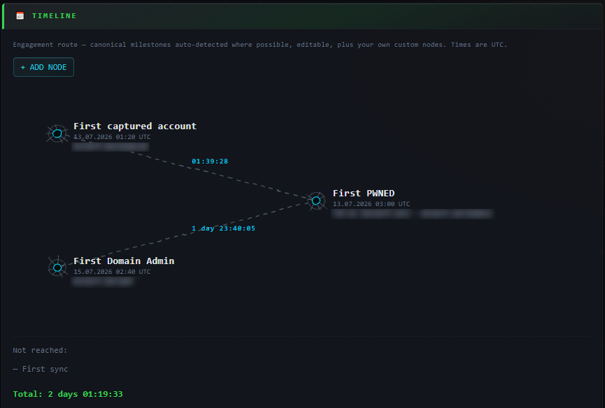
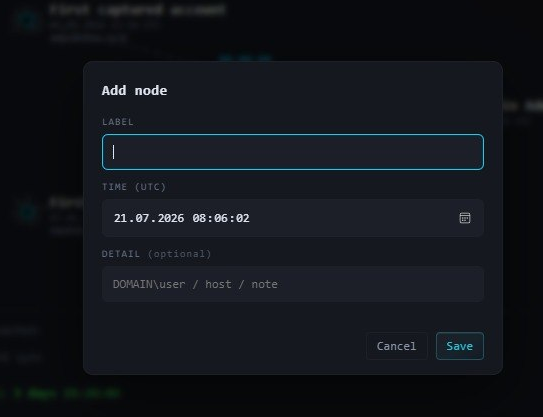
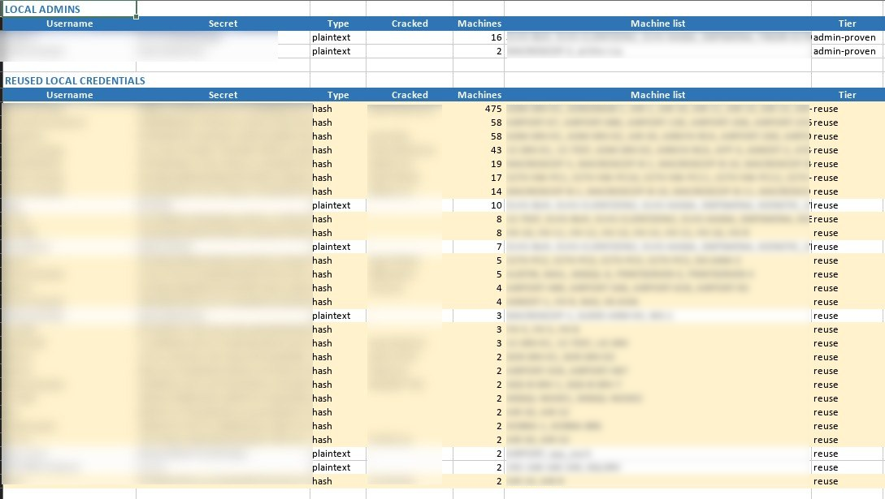

# Модуль — Reports 📄

Отчётный модуль: таймлайн проекта, авто-поиск локальных админов и итоговые выгрузки в одном месте.

---

## Блок 1 — TIMELINE

Таймлайн ключевых этапов работы в виде «карты»: узлы соединены штрих-пунктиром, рядом с ним — время, прошедшее от предыдущей точки. Всё время в UTC.

Четыре опорные точки определяются автоматически (где это возможно):

| Точка | Что это |
| ----- | ------- |
| **First sync** | Первая пришедшая синхронизация по проекту (даже пустая) — «начало работы». |
| **First captured account** | Самая ранняя захваченная учётка с секретом. |
| **First PWNED** | Первый хост с админ-доступом; в подписи — хост и учётка, которой он получен. |
| **First Domain Admin** | Первая учётка из watchlist доменных админов, для которой получены данные. |

У точек с учёткой к подписи добавляется её секрет: пароль в открытом виде, если он известен (в т.ч. взломанный через HashKiller), иначе хэш — `DOMAIN\user:secret`.

Любую точку можно **отредактировать** (кликом): задать своё время, подпись и данные — на случай ханипота, ложного срабатывания или ручной пометки. У изменённой точки есть возврат к авто-значению. Ещё не достигнутые точки показываются серым списком **Not reached** ниже маршрута.

- **+ ADD NODE** — добавить свой узел (например «получен VPN-доступ»).
- **↓ DOWNLOAD TIMELINE** (кнопка в блоке EXPORTS) — таймлайн в виде TXT-отчёта: точки со временем, интервалы между ними и общее время.

---

## Блок 2 — LOCAL ADMIN FOUNDER 💻

**↓ LOCAL ADMINS** — автоматический-поиск локальных админов по проекту и выгрузка в XLSX. Среди кучи учёток из LSA+SAM (где вперемешку локальные и доменные) выделяет локальные учетные записи — в первую очередь служит для выявления повторного использования пароля/хэша на разных машинах.

Доменные учётки, дампы с контроллеров, Guest и пустые пароли отсеиваются автоматически. Выгрузка состоит из двух секций:

- **LOCAL ADMINS** — локальные админы: помеченные оператором (💻 Mark as local admin в NXC Collector) и получившие admin-доступ (PWN3D) на SMB.
- **REUSED LOCAL CREDENTIALS** — локальные учётки, чьи креды повторяются на ≥2 машинах.

---

## Блок 3 — EXPORTS

Итоговые выгрузки по проекту.

| Кнопка | Что выгружает |
| ------ | ------------- |
| **👑 ALL CREDS ↓** | Все *уникальные* учётные записи проекта, разбитые на логические блоки. XLSX. |
| **⚡ ALL VULNS ↓** | Матрица уязвимостей по хостам (представление VULNS — ALL). XLSX. |
| **📅 DOWNLOAD TIMELINE ↓** | Таймлайн проекта из Блока 1. TXT. |

> Кнопка **ALL CREDS ↓** переехала сюда из тулбара NXC Collector. Сама выгрузка не изменилась.
