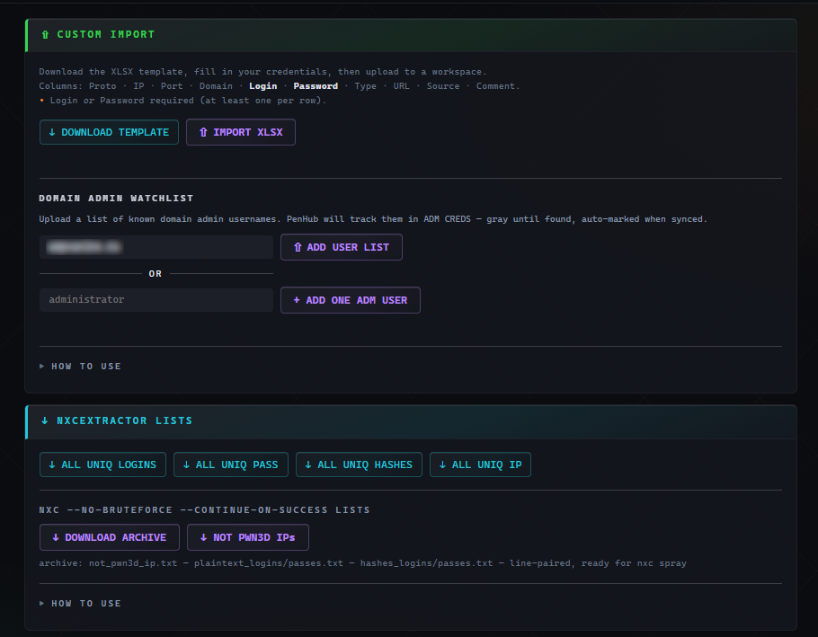
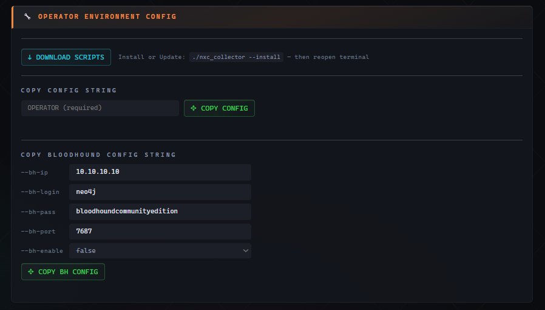
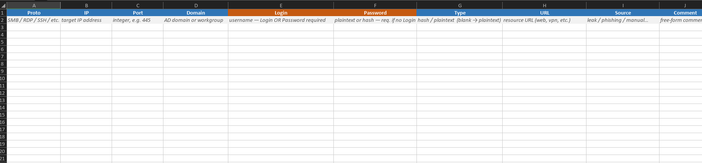
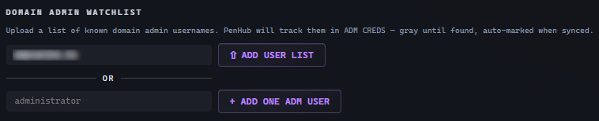
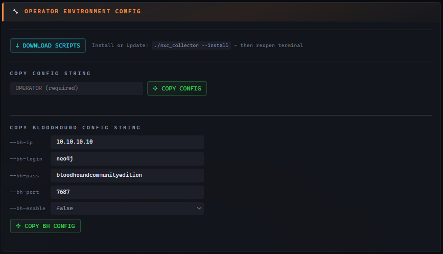

# Модуль — Toolbox ⚙

Набор утилиты, которые взаимодействуют с другими модулями: ручной импорт учетных данных, watchlist доменных админов, экспорт списков для credential-спреев и конфигурация окружения оператора.




---

## Блок 1 — CUSTOM IMPORT

### Custom Import (XLSX)

Добавление учетных записей в NXC Collector с использованием XLSX-шаблона.

- **↓ DOWNLOAD TEMPLATE** — скачать XLSX шаблон с подсказками.
- **↑ IMPORT XLSX** — парсит, обогащает, добавляет в базу.

Поля шаблона: Proto · IP · Port · Domain · **Login** · **Password** · Type · URL · Source · Comment.
**Login ИЛИ Password обязательны** (как минимум, что-то одно); остальные поля опциональны.




> Используйте это для добавления учетных данных, добытых вне nxc (веб, брут и пррочее). Для nt хешей применяется логика Hashkiller (нужно вписать hash в поле type импортируемого шаблона).

Такие учетные записи попадают в отчетную выгрузку ALL CREDS отдельным блоком.

### Domain Admin Watchlist

Подготовьте и импортируйте имена, которые являются доменными админами. PenHub следит за каждой синхронизацией: как только появляется пароль или хэш для имени из watchlist, эта учетная запись автоматически помечается `admin_cred=1`.

- Поле **Domain** — заполнится самым частым доменом в проекте; является обязательным при импорте.
- **↑ ADD USER LIST** — TXT-файл, один username на строку (строки длиннее 50 символов пропускаются).
- **+ ADD ONE ADM USER** — возможность добавить один username (domain + username обязательны).

Пока для имени из watchlist не найден пароль, оно показывается серой **ghost-строкой** в представлении ADM CREDS в NXC Collector. Кнопка **👻 CLEAR ADM GHOSTS** (в Manage Mode NXC Collector) удаляет ghost записи из watchlist.



---

## Блок 2 — NXCEXTRACTOR LISTS

Подготовка списков для запуска credential-спрея.

| Кнопка                 | Скачивает                                                                                                                                                               |
| ---------------------- | ----------------------------------------------------------------------------------------------------------------------------------------------------------------------- |
| **↓ ALL UNIQ LOGINS**  | Уникальные логины (credentials + DPAPI SMB), в нижнем регистре, без Guest. TXT.                                                                                         |
| **↓ ALL UNIQ PASS**    | Уникальные plaintext-пароли после HK-brute (взломанные хэши считаются как plaintext). TXT.                                                                              |
| **↓ ALL UNIQ HASHES**  | Уникальные непробрученные NT-хэши. TXT.                                                                                                                                 |
| **↓ ALL UNIQ IP**      | Уникальные IP всех обнаруженных хостов. TXT.                                                                                                                            |
| **↓ DOWNLOAD ARCHIVE** | ZIP из **5 файлов** для спрея nxc: `not_pwnd_ip.txt` + `plaintext_logins.txt` + `plaintext_passes.txt` + `hashes_logins.txt` + `hashes_passes.txt`. Строки для nxc 1:1. |
| **↓ NOT PWN3D IPs**    | Только `not_pwnd_ip.txt` — хосты, для которых не было авторизации с правами администратора.                                                                             |

**HOW TO USE** содержит инструкции и типовые команды.

> Парность 1:1 важна: строка N в `plaintext_logins.txt` идёт со строкой N в `plaintext_passes.txt`, поэтому nxc с `--no-bruteforce` перебирает подготовленные таким образом пары для авторизации. Те же файлы можно получить офлайн, с помощью `nxce --brute`.

---

## Блок 3 — OPERATOR ENVIRONMENT CONFIG

Все необходимое для подготовки окружения оператора к работе (см. **[Установка — Клиент оператора](Установка%20—%20Клиент%20оператора.md)**).

- **↓ DOWNLOAD SCRIPTS** — ZIP с `nxc_collector`, `nxce.py`, `nxc_updater.py`, `collector_dc.py`, `collector_hosts.py`. 
Установка : `./nxc_collector --install`, затем перезапустите терминал. 
Установщик  кладёт три скрипта в `/usr/local/bin` (или `~/bin`) и два `.py` NXC-модуля в `~/.nxc/modules/`.
- **COPY CONFIG STRING** — формирует и копирует готовую команду:
  ```
  nxc_collector -ws --server http://<IP> --port <PORT> --pass "<пароль>" --workspace <проект> --operator <вы>
  ```
  Поле **OPERATOR** обязательно; IP, порт, пароль и workspace подставляются автоматически с сервера.
- **COPY BLOODHOUND CONFIG STRING** — формирует команду `--bh-setup` для BloodHound (bh-ip обязательно; bh-login по умолч. `neo4j`, bh-pass `bloodhoundcommunityedition`, bh-port `7687`, bh-enable `true`). Настройки BloodHound сохраняются на сервере.



