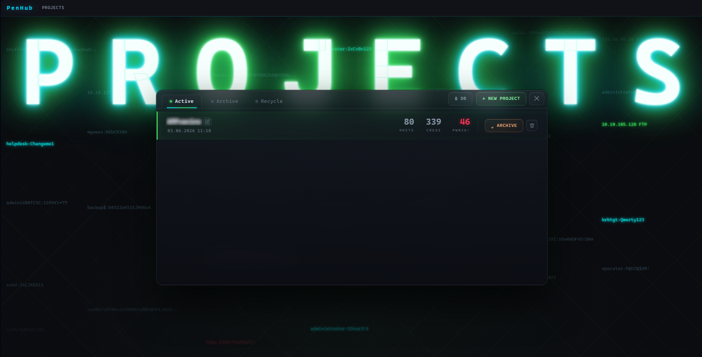
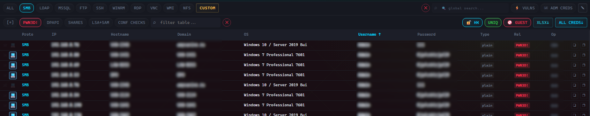

# Быстрый старт

## 1. Запустить сервер

На сервере (подробности — **[Установка — Сервер](../install/%D0%A3%D1%81%D1%82%D0%B0%D0%BD%D0%BE%D0%B2%D0%BA%D0%B0%20%E2%80%94%20%D0%A1%D0%B5%D1%80%D0%B2%D0%B5%D1%80.md)**):

```bash
pip install fastapi uvicorn openpyxl
python3 server.py --host 0.0.0.0 --port 322 --password "StrongPasswordHere!"
```

Откройте `http://<ip-сервера>:322/` в браузере и войдите по ключу доступа (--password).

---

## 2. Создать проект

На странице **Projects** нажмите **+ NEW PROJECT** и введите имя (например, `organisationX`). Проект — это изолированный воркспейс; данные между проектами не пересекаются.



---

## 3. Подключить оператора

На машине оператора возьмите скрипты и конфиг из **Toolbox → Блок 3** (см. **[Установка — Клиент оператора](../install/%D0%A3%D1%81%D1%82%D0%B0%D0%BD%D0%BE%D0%B2%D0%BA%D0%B0%20%E2%80%94%20%D0%9A%D0%BB%D0%B8%D0%B5%D0%BD%D1%82%20%D0%BE%D0%BF%D0%B5%D1%80%D0%B0%D1%82%D0%BE%D1%80%D0%B0.md)**), затем:

```bash
./nxc_collector --install                 # ставит скрипты + cron, после перезапустите шелл

# вставьте COPY CONFIG STRING из Toolbox Блок 3:
nxc_collector -ws --server http://<ip-сервера> --port 322 --pass "StrongPasswordHere\!" --workspace organisanionX --operator alice

nxc_collector --connection-test           # ожидается 200
```


---

## 4. Запустить nxc, затем синхронизировать

Просто используйте NetExec. Затем либо дождитесь cron (каждые 10 минут), либо запустите отправку данных на свой сервер вручную:

```bash
nxc_collector -upd
```

---

## 5. Просмотр в браузере

В проекте начнёт заполняться модуль **NXC Collector**. Попробуйте:

- Счётчик **PWN3D!** в шапке — хосты, где у вас есть админ.
- Строка протоколов: нажмите **SMB**, затем суб-вкладку **PWN3D!**, чтобы увидеть админ-сессии.
- **ALL CREDS ↓** — выгрузить все уникальные учетные данные в XLSX.



Подробнее: **[Модуль — NXC Collector](../modules/%D0%9C%D0%BE%D0%B4%D1%83%D0%BB%D1%8C%20%E2%80%94%20NXC%20Collector.md)**.

---

## 6. Подбор хешей

Откройте **HashKiller** и нажмите **⚡ SMART ENRICH**. Каждый plaintext-пароль, с которым вы авторизовались в рамках данного проекта, локально хэшируется и добавляется в вашу глобальную базу хэшей — так встретив его NT-хэш еще раз где-либо он автоматически «подберется». Кнопка **🕽 KILL THEM ALL** подставит уже имеющиеся в базе plaintext для любого хэша проекта, который вам встретился.

Подробнее: **[Модуль — HashKiller](../modules/%D0%9C%D0%BE%D0%B4%D1%83%D0%BB%D1%8C%20%E2%80%94%20HashKiller.md)**.

---

## 7. Выгрузить спрей

Откройте **Toolbox** → и нажмите **↓ DOWNLOAD ARCHIVE**. Скачается ZIP-архив с парными файлами целей/логинов/паролей/хэшей, готовыми к credential-спрею nxc (примеры команд смотрите в  **Toolbox** → How to use). 

Подробнее: **[Модуль — Toolbox](../modules/%D0%9C%D0%BE%D0%B4%D1%83%D0%BB%D1%8C%20%E2%80%94%20Toolbox.md)** и **[Пример работы](%D0%9F%D1%80%D0%B8%D0%BC%D0%B5%D1%80%20%D1%80%D0%B0%D0%B1%D0%BE%D1%82%D1%8B.md)**.

---

## 8. Взаимодействие с элементами интерфейса

Сортировка столбцов с данными, копирование нужной ячейки по нажатию, умное копирование, скрытие honeypot, отслеживание администраторов и другие функции уже доступны в PenHub. Изучайте и находите свои сценарии применения.

[[Wiki - оглавление]]
